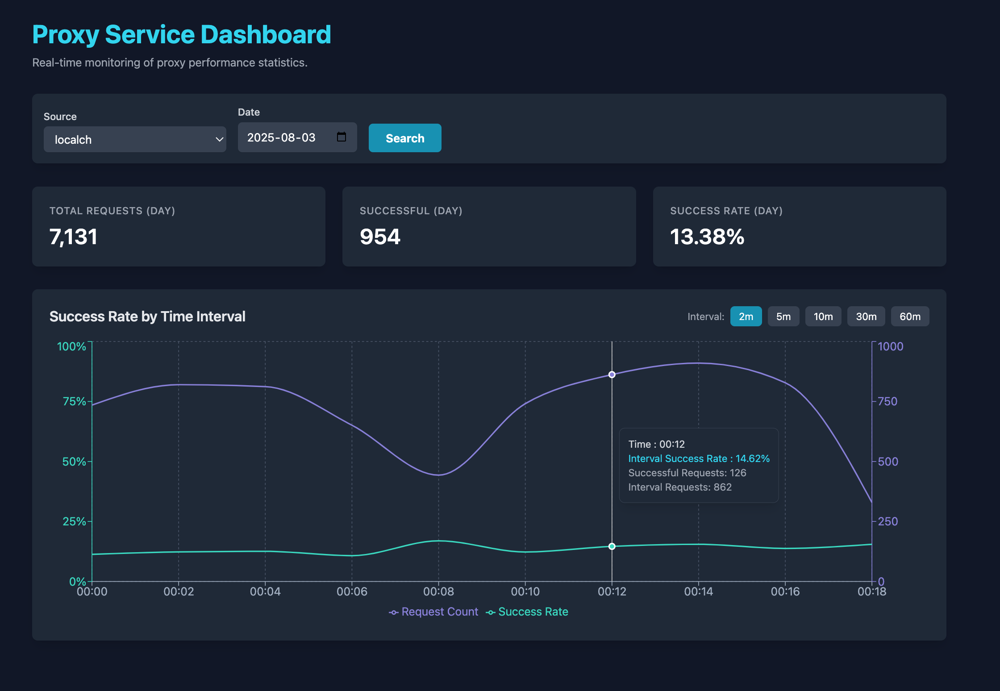

# **SmartProxy: An Intelligent, Self-Adapting Proxy Pool Service**

SmartProxy is a sophisticated proxy management system designed to provide reliable, high-quality proxy services. It automates the entire lifecycle of proxies, from fetching and validation to intelligent scoring and dynamic pool management, ensuring that your applications always have access to the best available proxies.



## **Core Features**

* **Automated Proxy Fetching**: Gathers proxies from multiple user-defined sources.  
* **Intelligent Validation & Scoring**: Continuously validates proxies and assigns a dynamic score based on performance (latency, success rate) and feedback.  
* **Feedback-Driven Adaptation**: A scoring system that penalizes failures and rewards success, allowing the pool to adapt based on real-world usage.  
* **Dynamic Source Reloading**: A hot-reload endpoint (/reload-sources) allows adding or removing proxy sources without restarting the service.  
* **Sustainable Validation Logic**: Employs a time-window-based attempt limit for re-validating failed proxies. This prevents proxy burnout, reduces database load, and ensures long-term service stability.  
* **Source-Specific Pools**: Maintains separate proxy pools for different sources/use cases.  
* **RESTful API**: Simple endpoints for fetching proxies and submitting feedback.  
* **Monitoring Dashboard**: A web-based UI to monitor the health and statistics of different proxy sources in real-time.

## **How It Works**

1. **Fetch**: The service periodically fetches proxy lists from various sources defined in config.ini.  
2. **Validate**: A validation cycle runs regularly. It prioritizes new and previously successful proxies. To avoid overwhelming unreliable proxies, it supplements the validation queue with failed proxies that have not been tested more than a configured number of times within a specific time window (e.g., 5 times in 30 minutes).  
3. **Score**: Proxies are managed in memory for each source. When a proxy is used, feedback is sent to the /feedback endpoint. Successful requests increase the proxy's score (with a bonus for low latency), while failures apply a penalty. The penalty becomes more severe with consecutive failures.  
4. **Select**: When a client requests a proxy for a specific source via /get-proxy, the system provides a random proxy from the pool of top-scoring candidates for that source.  
5. **Adapt**: Through continuous validation and feedback, low-quality proxies are phased out, and high-performing ones are prioritized, ensuring the overall quality of the pool constantly improves.

## **Installation and Setup**

### **Prerequisites**

* Python 3.8+  
* PostgreSQL

### **Steps**

1. **Clone the repository:**  
   git clone \<repository\_url\>  
   cd smartproxy

2. **Install dependencies:**  
   pip install \-r requirements.txt

3. **Set up the database:**  
   * Ensure your PostgreSQL server is running.  
   * Create a database and a user.  
   * Execute the database\_setup.sql script to create the necessary tables and indexes.  
     psql \-U your\_user \-d your\_db \-f database\_setup.sql

4. **Configure the service:**  
   * Rename or copy config.ini.example to config.ini.  
   * Edit config.ini with your database credentials, desired port, and proxy sources. See the **Configuration** section below for details.  

5. **Run the service:**  
   ```bash
   ./start.sh start           # Start the service
   ./start.sh stop            # Stop the service (auto-backup)
   ./start.sh restart         # Restart the service
   ./start.sh status          # Check service status
   ./start.sh logs            # Tail the log file
   ./start.sh backup          # Manual stats backup
   ./start.sh start --debug   # Start with verbose validation logging
   ```

   The service will start, and you can access the dashboard at http://localhost:6942 (or your configured port).

## **Configuration (config.ini)**

The service is configured via the config.ini file.

* **\[database\]**: Credentials for your PostgreSQL database.  
* **\[server\]**: port for the API and dashboard.  
* **\[validator\]**:  
  * validation\_target: URL used to test proxy connectivity.  
  * validation\_workers: Number of concurrent threads for validation.  
  * validation\_supplement\_threshold: If the number of new/active proxies to test is below this, the queue will be supplemented with failed proxies.  
  * validation\_window\_minutes: The time window (in minutes) for the validation attempt limit.  
  * max\_validations\_per\_window: The maximum number of times a failed proxy will be re-tested within the time window.  
* **\[scheduler\]**: Intervals for background tasks like fetching, validation, and flushing stats.  
* **\[sources\]**:  
  * predefined\_sources: A comma-separated list of logical names for your proxy pools (e.g., google\_search, web\_scraping).  
  * default\_source: The pool to use if a requested source doesn't exist.  
* **\[source\_pool\]**: Parameters for the scoring and selection algorithm.  
* **\[proxy\_source\_\*\]**: Define your proxy sources here. Each source should have its own section (e.g., \[proxy\_source\_freeproxies\]).  
  * url: The URL to fetch the proxy list from.  
  * update\_interval\_minutes: How often to fetch from this source.  
  * default\_protocol: The protocol (http, https etc.) if not specified in the source file.

## **API Documentation**

### **GET /get-proxy**

Fetches an available proxy for a specific use case.

* **Query Parameters**:  
  * source (required): The name of the source pool to get a proxy from (must match one in predefined\_sources).  
* **Success Response (200)**:  
  
```json
  {  
    "http": "http://1.2.3.4:8080",  
    "https": "http://1.2.3.4:8080"  
  }
```

* **Error Response (404)**: Returned if no proxies are currently available for the requested source.

### **POST /feedback**

Submits feedback on a proxy's performance. This is crucial for the scoring system.

* **Request Body** (JSON):  
  * source (string, required): The source pool the proxy belongs to.  
  * proxy (string, required): The full proxy URL (e.g., http://1.2.3.4:8080).  
  * status (integer, required): A status code representing the outcome. 0 and 4 are treated as failures; all other codes are successes.  
  * response\_time\_ms (integer, optional): The response time in milliseconds for successful requests. Lower times result in a higher score bonus.  
* **Success Response (200)**:  

```json
  { "message": "Feedback received." }
```

### **POST /reload-sources**

Triggers a hot-reload of the proxy source configuration from config.ini. This allows you to add or remove \[proxy\_source\_\*\] sections and update predefined\_sources without restarting the service.

```bash
curl -X POST -H "Content-Type: application/json" http://127.0.0.1:6942/reload-sources
```

* **Request Body**: Empty  
* **Success Response (200)**:  

```json
  {  
    "status": "success",  
    "message": "Configuration and sources reloaded.",  
    "details": {  
      "added_fetcher_jobs": ["proxy_source_new"],  
      "removed_fetcher_jobs": [],  
      "added_predefined_sources": ["new_pool"],  
      "removed_predefined_sources": []  
    }  
  }  
```

### **POST /backup-stats**

Manually triggers a backup of the in-memory proxy statistics to a JSON file.

```bash
curl -X POST http://127.0.0.1:6942/backup-stats
```

* **Request Body**: Empty  
* **Success Response (200)**:  

```json
{
  "status": "success",
  "path": "./data/proxy_stats_backup.json",
  "sources": 4,
  "total_proxies": 1500
}
```

### **GET /get-premium-proxy**

Fetches a premium (highest quality) proxy for Playwright and other high-reliability use cases. Returns one of the top-scoring proxies across all sources.

```bash
curl http://127.0.0.1:6942/get-premium-proxy
```

* **Query Parameters**: None required  
* **Success Response (200)**:  

```json
{
  "http": "http://1.2.3.4:8080",  
  "https": "http://1.2.3.4:8080",
  "premium": true
}
```

* **Error Response (404)**: Returned if no premium proxies are currently available.

**Note**: Premium proxies are selected from proxies with at least 50 uses (configurable via `premium_min_usage_count`) and sorted by score. This ensures only battle-tested, high-quality proxies are returned.

### **GET /health**

Health check endpoint for monitoring.

```bash
curl http://127.0.0.1:6942/health
```

* **Success Response (200)**:

```json
{
  "status": "healthy",
  "active_proxies": 1500,
  "premium_proxies": 50,
  "sources": 4,
  "is_validating": false
}
```

### **GET /metrics**

Prometheus-compatible metrics endpoint.

```bash
curl http://127.0.0.1:6942/metrics
```

* **Success Response (200)**: Returns metrics in Prometheus text format.
